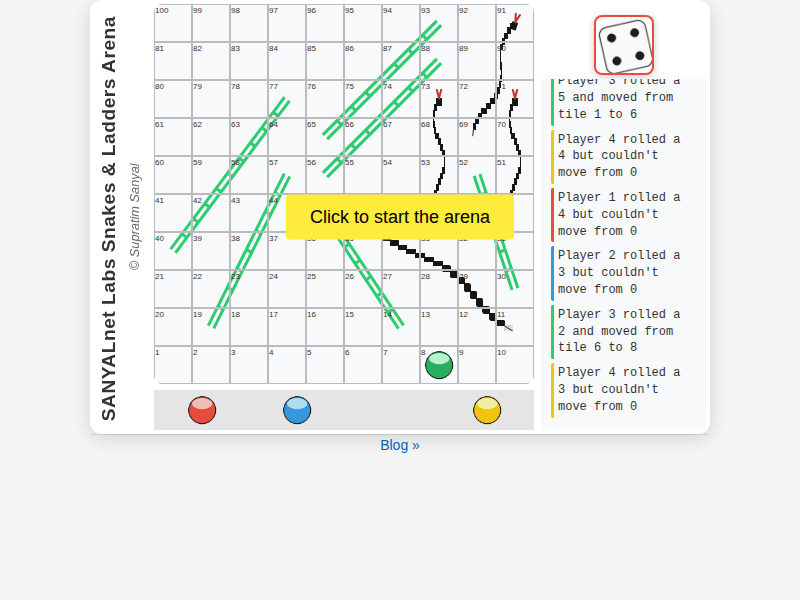

# 🐍🪜 SANYALnet Labs – Indian Snakes & Ladders Arena

> **A fully-automated, browser-based, 4-player Indian Snakes & Ladders arena**  
> Procedural boards · SVG snakes & ladders · real-time animation · zero-click auto-play

---

## ✨ Highlights

| Feature | Details |
|---------|---------|
| **Authentic Indian rules** | Entry on 1 or 6, exact landing on 100, capture (Katti), triple-six penalty, extra turn on 6 |
| **Procedural boards** | 4–6 ladders & 4–6 snakes each game, geometrically validated (no crossings, minimum row-span, fairness zone) |
| **SVG-rendered pieces** | Sinuous, speckled yellow/black snakes with tiny heads & whip tails; two-rail ladders with interior rungs only |
| **Smooth animation** | Token walks tile-by-tile then glides along the exact SVG path; CSS transitions suppressed during jumps for zero wobble |
| **Audio cues** | 12 event sounds (roll, step, settle, ladder, snake, six, triple-six, turn, win, game-over, capture, enter) with autoplay-policy gate |
| **Kiosk-ready** | Detects `display-mode: standalone`; hides start button when autoplay allowed |
| **Auto-play arena** | Starts, plays to completion, shows winner, waits 10 s, regenerates board, repeats — no user input required |
| **Responsive layout** | 3-column flex UI (title • board • commentary) that works from desktop down to 600 px |
| **Zero-build** | Pure ES6 modules, plain CSS, static files — drop into any static host (GitHub Pages, Netlify, Nginx) |

---

## 🎮 Live Demo

```bash
# 1. Clone
git clone https://github.com/tuklusan/snakes-and-ladders-arena.git
cd snakes-and-ladders-arena

# 2. Serve (no build step)
python3 tools/serve_nocache.py 8000
# → open http://localhost:8000  (or http://<your-lan-ip>:8000)
```

The server sends `Cache-Control: no-store` so every reload picks up the latest code — ideal for kiosk / active development.

---

## 🖼️ Screenshots

| Board view | Speckled snakes & ladders |
|------------|---------------------------|
|  |  |

*Screenshots captured with headless Puppeteer from the running arena.*

---

## 🏗️ Architecture (MVC)

```
index.html
└─ main.js                 → bootstraps
   ├─ gameModel.js         → state, procedural board generator, geometry helpers
   ├─ gameController.js    → rules engine (ProcessTurn, capture, triple-six, win)
   └─ gameView.js          → DOM, SVG, animation loop, audio, commentary
```

*All logic is deterministic; the only randomness is `Math.random()` for dice and board generation.*

---

## 📜 Rules Quick-Reference (GAME-RULES.md)

1. **Start** – all pawns at 0 (off-board)  
2. **Enter** – roll 1 or 6 → pawn appears on tile 1  
3. **Move** – pawn advances `roll` tiles; overshooting 100 cancels move  
4. **Ladders** – land on ladder foot → climb to top instantly  
5. **Snakes** – land on snake head → slide down to tail  
6. **Capture (Katti)** – land on opponent (not in safe zones 0, 1, 100) → opponent returns to 0  
7. **Six bonus** – roll 6 → extra turn (max 2 consecutive)  
8. **Triple-six penalty** – three 6s in one turn → all movement reverted, turn ends  
9. **Win** – first pawn to land **exactly** on 100 wins

---

## 🛠️ Development

```bash
# Run visual validation (requires Puppeteer)
node tools/validate_all_fixes.js   # OI-1, OI-3, OI-4
node tools/validate_oi2.js         # OI-2 snake uniformity

# Lint
npx eslint src/js/
```

### Key source locations

| Feature | File / Lines |
|---------|--------------|
| Board generator & validation | `src/js/gameModel.js:138-258` |
| Snake rendering (speckle filter, uniform width) | `src/js/gameView.js:360-470` |
| Head / tail SVG elements | `src/js/gameView.js:2070-2150` |
| Ladder rung loop (interior only) | `src/js/gameView.js:340` |
| Token animation (step + jump) | `src/js/gameView.js:1270-1480` |
| Audio autoplay probe & start button | `src/js/gameView.js:810-897` |

---

## 📦 Release History

| Tag | Date | Notes |
|-----|------|-------|
| `beta-0.0.1` – `beta-0.0.5` | 2026-08 | Incremental fixes (tongue direction, wobble analysis, etc.) |
| **`beta-0.1.0`** | **2026-08-29** | **All open issues resolved:** tile font 50 %, ladder interior rungs, snake traversal + audio, uniform speckled snakes |

---

## 🚀 Roadmap (post-β)

- Formal test suite (Vitest + Playwright) + GitHub Actions CI  
- Module split: `SnakeRenderer`, `LadderRenderer`, `TokenAnimator`, `AudioManager`  
- Static-host packaging (esbuild / Vite) for GitHub Pages deploy  
- Accessibility pass (ARIA, keyboard nav, colour-contrast audit)  
- i18n support (Hindi, Bengali, …)  

---

## 📄 License

MIT – see `LICENSE` (to be added).  
Assets (tokens, dice, audio) are CC0 / Kenney.nl – see `assets/*/CREDITS.md`.

---

## 🙏 Credits

* **Author** – Supratim Sanyal / SANYALnet Labs  
* **Snake reference art** – `assets/reference/snake_example.jpg`  
* **Audio** – Kenney “Impact” & “Interface” packs (CC0)  

---

> **“Roll the dice. Watch the arena play itself. Repeat.”**  
> — *SANYALnet Labs*